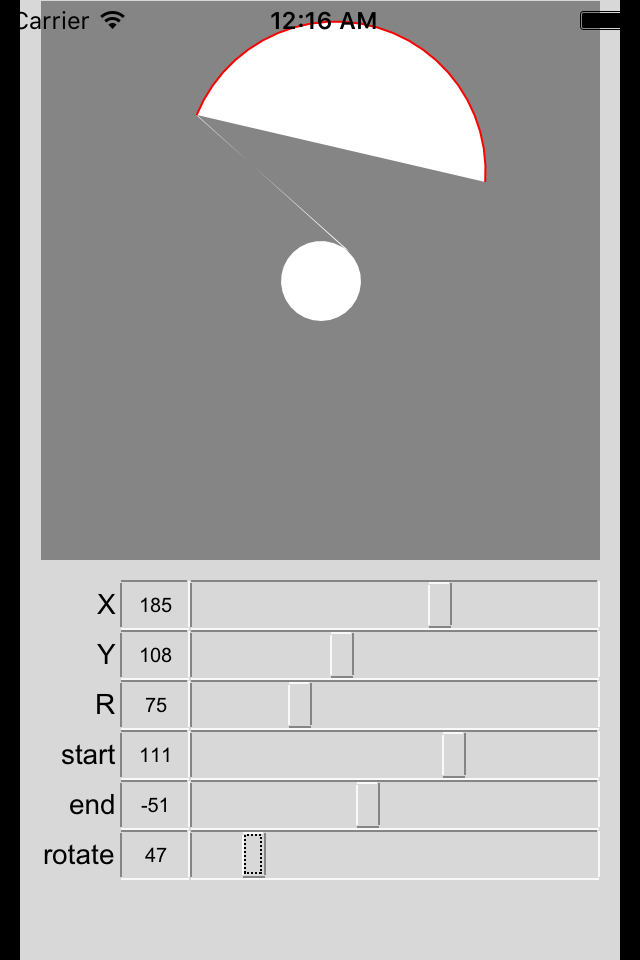
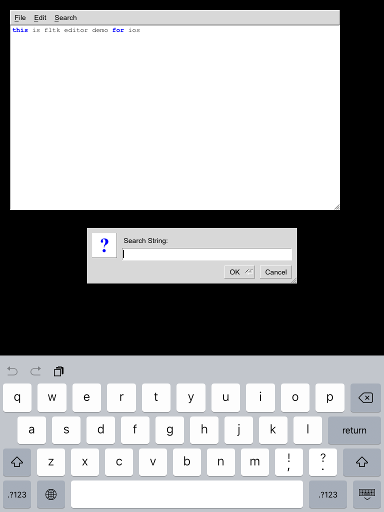

# minifltk
Port of FLTK to ios(almost release) and android(not work)

============================

### Compile with xcode
1. Create osx app project manual
2. add all src
3. delete storyboard info from plist
3. compile
